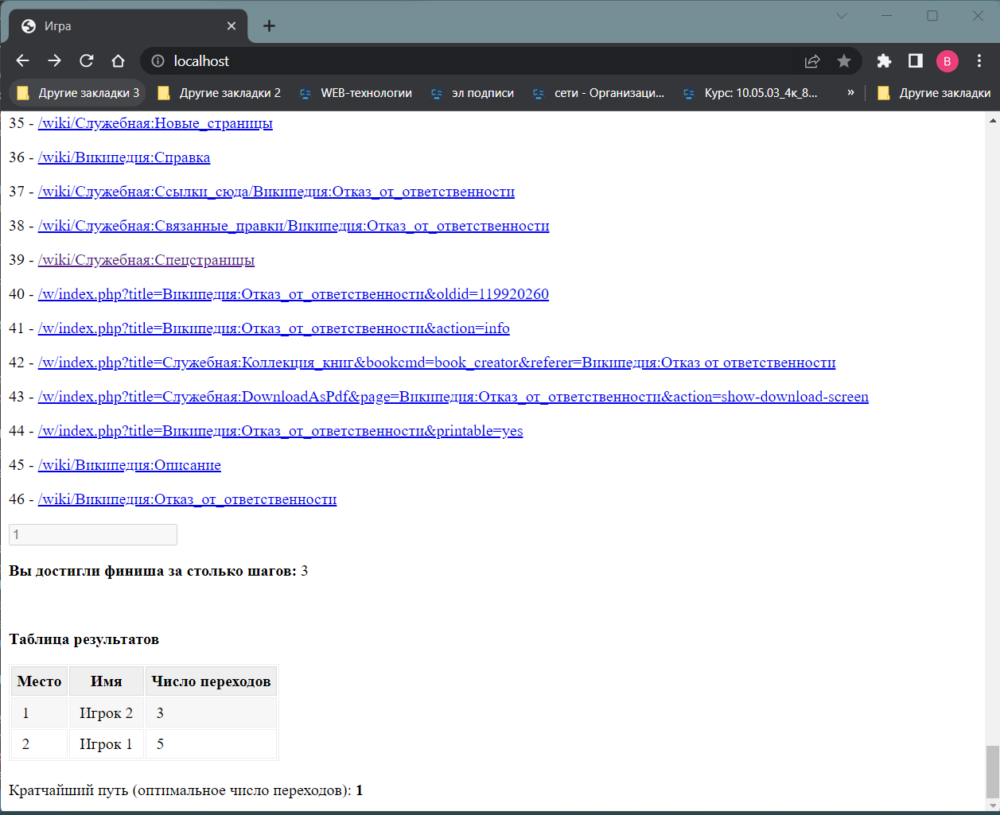

# wikipedia-php-game-2023
Перед первым использованием кода нужно инициализировать БД:
```bash
php -f migrations.php
```

Ссылку на этот репозиторий присылаю заранее

Но код будет дорабатываться до окончания конкурса 10 мая 23:59 по Москве по мере наличия свободного времени

Для собственных нужд я обычно использую GitFlic, а не Github, поэтому большинство других моих проектов с открытым кодом вы найдёте по адресу:
> <https://gitflic.ru/user/bogdanov-viktor>

Web-приложение "wikipedia-php-game-2023" представляет собой игру, в которой нужно перемещаться по страницам Википедии

План написания этого приложения:
1. Сделать минимальный продукт, который будет выполнять все условия задания
2. Затем начать дорабатывать этот продукт до полноценной Online игры. Т.е. добавить авторизацию пользователей, сохранение на сервере всех результатов их противоборств, улучшить API для защиты от взлома (фальсификации результатов игры, чужих ходов) и т.д.

Пункт 2 этого плана очень долог для реализации и его 100% не реализовать одному человеку за время, которое обычно отводится на конкурсы (и там придётся самому реализовывать некоторый функционал, который есть в фреймворках - по условию задания фреймворки использовать нельзя)

Но пункт 1 всё равно выполняется так, чтобы можно было постепенно добалять функционал из пункта 2 не меняя архитектуру кода

Вся логика игры реализуется на чистом PHP

Клиентская часть (чистые JS, HTML, CSS) занимается только тем, что показывает на экране информацию для пользователю и отправляет серверу, как решил сходить пользователь

Есть чёткое разделение на Backend и Frontend, между ними API. Сервер и клиент обмениваются данными в формате JSON.

Т.е. большая часть приложения реализуется не на клиенте, а в бэкенде на PHP (т.к. это требуется в задании)

Достоинство такого подхода:
* можно реализовать защиту игры от взлома, не придумывая сложных решений, т.к. вычисления выполняет сервер, который точно не подделает результаты
* позволяет писать меньше кода на клиентах в то время, как кроме web-клиента (который я написал), может быть несколько реализаций клиентов в виде приложений под разные платформы: android-приложение, windows-приложение и т.д.

Недостаток:
* требует больше вычислительных ресурсов от сервера для обслуживания того-же числа пользователей

## Снимки работы программы


